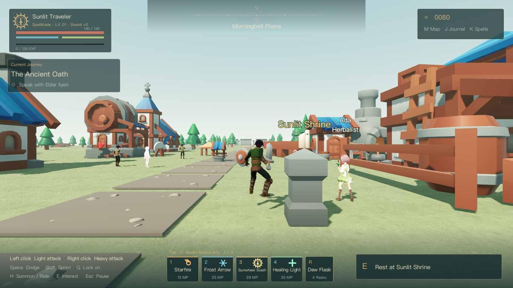

# Aurelia — The Sunlit Realms

**A bright fantasy action RPG prototype built with Godot 4.6.** Explore compact towns and dungeons, wield swords and twelve spells, ride a horse, and challenge 20 bosses with friends in a shared world.

**English / 繁體中文** — choose your language on the title or pause screen. [繁體中文說明](README.zh-TW.md)



## Version 0.7.0

- **Switch between Traditional Chinese and English** without restarting. Menus, character creation, spells, dialogue, quests, maps, combat messages and world labels follow your selection. The preference is saved locally, independently of character saves and multiplayer state.
- **Credits & Licenses** on the title screen identifies the artists and the licenses attached to their work. Windows packages include original notices, font copyright information and engine dependency licenses.
- **English README** and bilingual Windows instructions.
- Retains the compact **2.4 × 2.4 km** world introduced in 0.6.0: 72 additional settlements, 19 regional dungeons, 20 bosses, 32 roadside stops, 32 additional enemies and 64 additional herb nodes.

The main settlement grid is approximately 440 meters apart, reduced from 2,000 meters. Old solo saves relocate distant shrine checkpoints to the corresponding settlements while keeping character and quest progress. See [compact-world implementation notes](docs/COMPACT-WORLD.md).

## Quick start

```sh
git clone https://github.com/Chihen-Tai/GPT-6_generate_game.git
cd GPT-6_generate_game
```

Install **Godot 4.6 Standard**; .NET is not required. Import `project.godot` in the project manager, wait for asset import to finish, then press **F5**. Models, textures, animations and audio needed to run the game are included. Blender is only needed for the optional authoring workflow.

With `godot` on your PATH:

```sh
godot --headless --path . --editor --import --quit
godot --path .
```

macOS users can run `Launch.command`, which checks the local bundled engine, `/Applications/Godot.app`, then PATH. Forward+ is the default renderer; try `--rendering-method gl_compatibility` if your GPU cannot start it.

### Language selection

Use the language dropdown on the **title screen** or **pause screen**. Select **Language · English** or **語言 · 繁體中文**. The selection is stored in `user://preferences.cfg` and applies immediately, including NPC and boss nameplates. Player-entered names are kept as entered. Original legal notices remain in their original language.

For a temporary command-line override:

```sh
godot --path . -- --language=en
godot --path . -- --language=zh_TW
```

## Combat and progression

- Male/female character selection and five classes: Spellblade, Guardian Knight, Elementalist, Wind Ranger and Dawn Priest.
- Three-hit light combos, heavy attacks, target lock, dodge invulnerability, stamina, sprinting, mounted combat and healing.
- Twelve spells: Starfire, Frost Arrow, Sunwheel Slash, Healing Light, Chain Lightning, Falling Star, Frostbloom Field, Gale Blades, Astral Sword Array, Dawnbreak Lance, Starveil Ward and Finale: Falling Heavens.
- Levels **1–50**. Kills grant experience; class-specific health and mana grow on level-up. Each additional level adds 2.5% of base damage to sword and spell attacks.
- Twenty bosses with varied windups, delayed attacks, combos and area skills. The final Sky Dragon changes phase at 66% and 30% health.
- 244 NPC records, including merchants, cooks, artisans and named starting villagers. Gather herbs, cook supplies, trade and upgrade weapons.

## Controls

| Input | Action |
| --- | --- |
| WASD / Mouse | Move / Rotate camera |
| Shift / Space | Sprint / Dodge |
| Left / Right mouse | Light combo / Heavy attack |
| Q / H | Lock on / Summon, mount or dismount |
| Tab / 1–4 | Cycle spell set / Cast |
| K / R | Spellbook / Drink flask |
| E | Talk, gather or interact with a shrine |
| M / J / Esc | Map / Journal / Menu |

Talk to the elder and prepare supplies before exploring. Shrines restore resources and provide waystation travel.

## Multiplayer

Up to **32 players** connect to one ENet server. Combat, enemy state and experience awards are server-authoritative. To host:

```sh
godot --headless --path . -- --server --port=24567
```

On macOS, `Server.command` runs the same dedicated-server mode. Other players choose **Multiplayer · Shared World** and enter the host's address and **UDP port 24567**. Internet play requires the host's firewall and router to allow/forward that UDP port. This repository does not provide a deployed public server.

Each player can choose their own interface language. Use the latest release on clients and server. Multiplayer characters are currently **session-only guests**: they start at level 1, and their online level and inventory are not retained after disconnecting. Leaving restores the player's solo progress. Opening a menu does not pause multiplayer.

The 32-client test checks connections and snapshot delivery, not 32-player combat or GPU performance. Further setup details: [multiplayer notes](docs/MULTIPLAYER.md).

## Saves

Solo progress is saved when resting, trading, defeating enemies, updating quests and exiting normally. Character progression uses `user://aurelia_save.json`; language uses a separate `user://preferences.cfg`.

On macOS these are under `~/Library/Application Support/Godot/app_userdata/曦光之境 · AURELIA/`. The internal project name stays unchanged so switching language does not move your saves.

## Licenses and artist credits

**The source-code license is not a blanket license for the artwork.** Aurelia's own code, scene definitions, shaders, tools, translations and documentation use the [MIT License](LICENSE). Third-party works keep their individual licenses, including when converted, retargeted or bundled into the game.

| Author / Project | Included work | License |
| --- | --- | --- |
| Kay Lousberg / KayKit | Characters, buildings, dungeons and props | CC0-1.0 |
| Quaternius | Houses, monsters, animals, outfits and animations | CC0-1.0, listed free editions |
| pixiv Inc. | HairSample_Male and specific legacy beta Vivi/Victoria models | CC0-1.0 for those specific samples |
| Kenney and credited contributors | Particle textures | CC0-1.0 |
| Rob Tuytel / Poly Haven | Grass Path 2 textures | CC0-1.0 |
| Rico Cilliers / Poly Haven | Modular Fort 01 | CC0-1.0 |
| Adobe / Noto project | Noto Sans CJK TC Regular | SIL OFL 1.1 |
| Godot contributors and library authors | Engine and dependencies in exported builds | MIT and dependency-specific licenses |

Read [THIRD_PARTY_NOTICES.md](THIRD_PARTY_NOTICES.md) for source links, modifications, author notices and scope. The [licenses](licenses) directory and individual asset folders preserve original notices. The game does not claim these artists' work as its own or imply their endorsement. Preserve the notices when redistributing builds; the applicable license texts govern permissions.

## Project structure

| Path | Contents |
| --- | --- |
| `scenes/`, `scripts/`, `shaders/` | Godot scenes, gameplay, networking and rendering |
| `translations/en.json` | English catalog for the original Traditional Chinese text |
| `assets/` | Runtime models, textures, fonts, animations and audio |
| `art/*.py` | Blender assembly and animation-retargeting tools |
| `tools/` | Asset processing, multiplayer testing and packaging |
| `tests/`, `docs/`, `licenses/` | Verification, design notes and license records |

Generated Blender files, source-download archives, Godot import caches, engine executables and exported ZIPs are excluded from Git. Asset authoring is optional: the runtime resources are already included. See [art workflow](art/README.md) and [source download records](art/vendor/downloads.json).

## Testing

```sh
godot --headless --path . --editor --import --quit
godot --headless --path . --script tests/language_test.gd
godot --headless --path . --script tests/compact_layout.gd
godot --headless --path . --script tests/continental_runner.gd
godot --headless --path . -- --smoke-test
godot --headless --path . --script tests/leveling.gd
python3 tools/test_network.py
python3 tools/check_licenses.py
python3 tools/check_translations.py
```

Python network tests use `godot` from PATH or the local engine bundle; set `GODOT` to override the executable. They use isolated test ports. See [verification records](tests/VERIFICATION.md) for results and limitations.

## Windows build

Requires Python 3 and Godot 4.6:

```sh
python3 tools/fetch_windows_templates.py
mkdir -p builds/Aurelia-Windows
godot --headless --path . --export-release "Windows x64"
python3 tools/test_network.py --pack builds/Aurelia-Windows/Aurelia.pck
python3 tools/package_windows.py
```

Send friends `builds/Aurelia-Windows.zip`. Extract the entire archive and run `Aurelia.exe`, keeping `Aurelia.pck` beside it. The package includes English/Chinese instructions, a compatibility launcher, a SHA-256 checksum alongside the ZIP and third-party notices. The ZIP is a local build artifact and is not committed to this repository.

## Current limitations

This is a playable prototype. Towns, dungeons, characters and animations share templates. It does not yet have a complete story, long-term balance, persistent online accounts or the production quality of a commercial anime RPG. Tested on macOS / Apple M4; exported Windows builds still need real Windows GPU compatibility testing.
