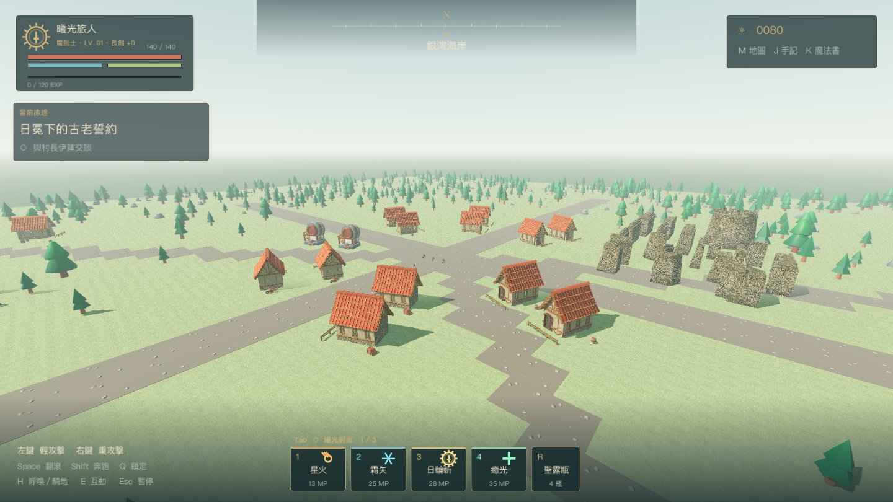
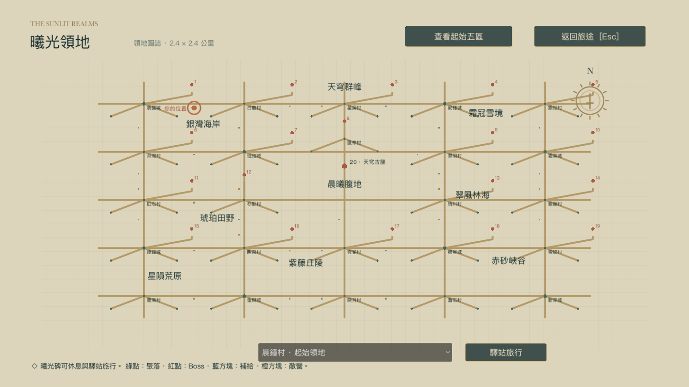

# 曦光之境 · AURELIA

明亮奇幻風格的 **Godot 4.6 三維動作 RPG 原型**。可選男女主角及五種職業，使用劍技、十二種魔法、翻滾與騎馬探索世界，與朋友一起挑戰 20 隻 Boss。



## 0.6.0：縮小地圖，增加沿途內容

原本 10 × 10 公里的世界縮為 **2.4 × 2.4 公里**，面積減少約 94%。主要聚落間距從 2,000 公尺降到約 440 公尺，鄰近村落約 185 公尺。保留原有五個起始區域、九個領地分區、72 個擴充聚落與 19 座地城，最終 Boss 仍為三階段天穹古龍。

- 新增 **32 個路邊營地／遺跡**：16 處補給營地、16 處敵方據點，增加 32 隻小怪及 64 處可採集草藥。
- 調整建築間距、道路入口、林地密度、地圖比例與雪地／沙地分布。
- 200 公尺地塊按玩家位置載入；單一玩家周圍最多九個地塊。
- 舊單人存檔會把遠方曦光碑轉到同名聚落的新位置，保留等級、背包、任務與 Boss 進度。



詳細布局與存檔轉換見 [緊湊地圖說明](docs/COMPACT-WORLD.md)。

## 取得與啟動

```sh
git clone https://github.com/Chihen-Tai/GPT-6_generate_game.git
cd GPT-6_generate_game
```

安裝 **Godot 4.6 Standard**（不需要 .NET），從專案管理員匯入 `project.godot`，待資源匯入完成後按 **F5**。已轉換好的模型、材質、動畫與音效包含在 `assets/`；玩遊戲不需要 Blender。首次匯入較久，請讓 Godot 完成貼圖與模型轉換。

若已將 Godot 設為 `godot` 指令，也可執行：

```sh
godot --editor --path . --import
godot --path .
```

macOS 可雙擊 `Launch.command`，它會尋找專案內、`/Applications/Godot.app` 或 PATH 中的引擎。Forward+ 為預設；若硬體無法啟動，可試 `godot --path . --rendering-method gl_compatibility`。

**Windows 朋友測試包**是本機匯出後的 `builds/Aurelia-Windows.zip`。完整解壓縮後開啟 `Aurelia.exe`，旁邊保留 `Aurelia.pck`，不需安裝引擎。Git 儲存庫包含遊戲原始碼與執行素材；引擎、匯出模板及 Windows ZIP 不納入 Git，匯出方法見下方。

## 角色、戰鬥與等級

- 可選男女角色、魔劍士／守護騎士／元素法師／疾風遊俠／曦光祭司，配置四個優先技能。
- 三連輕攻擊、重擊、鎖定、翻滾無敵窗口、體力、奔跑、騎馬、治療與護盾。
- 十二種魔法：星火、霜矢、日輪斬、癒光、天雷連鎖、熾星墜落、霜華領域、蒼嵐三刃、星穹劍陣、破曉光槍、星紗護壁、終式・天星。
- 1–50 級，擊殺獲得經驗；依職業增加生命與魔力，每級增加基礎傷害的 2.5%。規則見 [等級系統](docs/LEVELING.md)。
- 20 隻 Boss 包含不同前搖、快慢刀、連段與範圍技能；最終古龍在生命 66%／30% 轉階段。
- 244 筆 NPC，包含商人、烹飪師、工匠與起始村具名居民；支援採集、交易、料理與武器強化。

## 操作

| 按鍵 | 動作 |
| --- | --- |
| WASD／滑鼠 | 移動／轉動視角 |
| Shift／Space | 奔跑／翻滾 |
| 滑鼠左鍵／右鍵 | 三連輕攻擊／重擊 |
| Q／H | 鎖定／呼喚馬匹、上下馬 |
| Tab／1–4 | 切換術式組／施放技能 |
| K／R | 魔法書／喝聖露瓶 |
| E | 交談、採集、曦光碑互動 |
| M／J／Esc | 地圖／手記／選單 |

先與村長交談、準備補給，再沿道路探索。曦光碑可以休息、補充聖露瓶及使用驛站旅行。

## 多人聯機

所有玩家連到同一台 **最多 32 人**的 ENet 伺服器，由伺服器判定戰鬥、敵人狀態與經驗獎勵。開服：

```sh
godot --headless --path . -- --server --port=24567
```

macOS 也可雙擊 `Server.command`。朋友選「多人聯機」，輸入開服者提供的 IP 和 **UDP 24567**。跨網路需設定開服端路由器的 UDP 轉發及防火牆，詳見 [聯機說明](docs/MULTIPLAYER.md)。本儲存庫不提供已部署的公網伺服器。

**所有玩家與伺服器須使用 0.6.0。** 訪客角色在每次連線由 1 級開始，個人聯機等級與背包不跨連線保存；退出後恢復原本單人進度。聯機選單不會暫停世界。32 人連線容量測試不等於 32 人戰鬥或 GPU 效能保證。

## 存檔

單人休息、交易、擊殺、任務更新與正常退出會保存等級、經驗、物品及世界進度。存檔為 Godot 的 `user://aurelia_save.json`；macOS 位於 `~/Library/Application Support/Godot/app_userdata/曦光之境 · AURELIA/`。新版本兼容舊格式，舊地圖的有效聚落存檔會自動轉換，無法辨識的位置回到起始曦光碑。

## 專案結構與素材

| 路徑 | 內容 |
| --- | --- |
| `scenes/`、`scripts/`、`shaders/` | Godot 場景、玩法、多人同步與著色器 |
| `assets/` | 可直接匯入的模型、動畫、貼圖、字型與音效 |
| `art/*.py` | Blender 素材組裝、動畫重定向與轉換腳本 |
| `tools/` | 素材處理、測試及 Windows 打包工具 |
| `tests/`、`docs/` | 自動測試、規則、來源及限制 |

建築、人物、怪物使用 Quaternius、KayKit、pixiv 舊版 CC0 樣本、Poly Haven 等公開素材；實際來源及各自授權見 [環境素材](assets/vendor/LICENSES.md)、[角色與動畫](art/vendor/LICENSES.md) 和各素材資料夾的授權檔。中文字型使用 Noto Sans CJK TC，授權見 `assets/fonts/OFL.txt`。第三方素材仍依其個別授權散布。

大型原始下載壓縮檔、產生的 `.blend`、Godot 匯入快取與本機測試日誌不納入 Git。若要重新製作模型，參考 [美術流程](art/README.md) 與 `art/vendor/downloads.json` 取得來源；一般執行不需重做模型。

## 測試與 Windows 匯出

```sh
godot --headless --path . --editor --import --quit
godot --headless --path . --script tests/compact_layout.gd
godot --headless --path . --script tests/continental_runner.gd
godot --headless --path . -- --smoke-test
godot --headless --path . --script tests/leveling.gd
python3 tools/test_network.py
```

Python 聯機測試會尋找 PATH 中的 `godot` 或本機引擎，也可透過 `GODOT` 環境變數指定執行檔。測試使用獨立連接埠，不會替你啟動公開伺服器。

Windows 匯出（需要 Python 3、Godot 4.6）：

```sh
python3 tools/fetch_windows_templates.py
mkdir -p builds/Aurelia-Windows
godot --headless --path . --export-release "Windows x64"
python3 tools/test_network.py --pack builds/Aurelia-Windows/Aurelia.pck
python3 tools/package_windows.py
```

產生 ZIP 與 SHA-256 校驗檔，包內附中文操作說明及素材授權。檢查結果見 [驗證紀錄](tests/VERIFICATION.md)。

本作仍為原型：部分聚落與地城共用布局、角色造型及動作，沒有完整劇情或長期數值平衡；畫面尚未達大型商業動漫 RPG 的精細程度。已在 macOS／Apple M4 驗證，Windows 包尚未完成實機顯示卡相容性測試。
